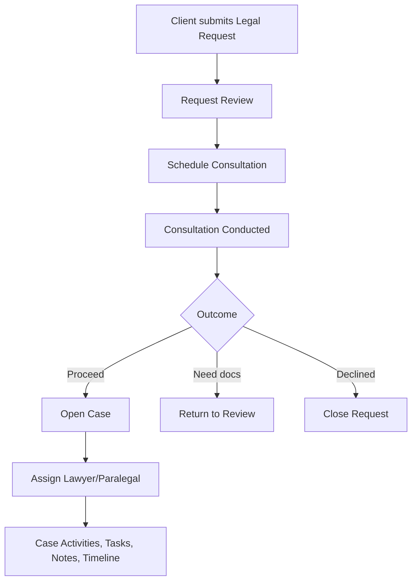

# Phase 2 — Legal Intake, Case Request & Representation Workflow

**SANSON Legal OS** | Powered By: CoreLogic

## Scope Delivered

Phase 2 implemented the legal operations workflow foundation (non-AI) for:

- Legal Representation Requests
- Appointment Scheduling Workflow
- Case Lifecycle Foundation
- Lawyer/Paralegal Assignment + Transfer History
- Case Activities
- Consultation Notes + Outcomes
- Task Management
- Internal Comments
- Timeline Framework

Excluded by design: AI chatbot/intake, OCR, document analysis, vector search, realtime infrastructure, mobile app.

## Database Changes

### New Migration Files

- `scripts/migrations/003_phase2_schema.sql`
- `scripts/migrations/004_phase2_seed.sql`

### New Tables

1. `legal_requests`
2. `appointments`
3. `case_statuses`
4. `cases`
5. `case_activities`
6. `case_assignments`
7. `tasks`
8. `comments`
9. `consultation_notes`
10. `consultation_outcomes`
11. `timelines`

### New Enum Types

- `case_category`
- `priority_level`
- `legal_request_status`
- `consultation_type`
- `appointment_status`
- `task_status`
- `assignee_role`
- `consultation_outcome_type`
- `timeline_event_type`

### Seeded Data

- Full `case_statuses` workflow (OPEN → ARCHIVED)
- Phase 2 permissions for requests/appointments/cases/tasks/comments/consultations/timelines
- Role-permission matrix updates for CLIENT / LAWYER / PARALEGAL / ADMIN

## API Endpoints Added (`/api/v1`)

### legal-requests
- `POST /legal-requests/`
- `GET /legal-requests/`
- `GET /legal-requests/{request_id}`
- `PATCH /legal-requests/{request_id}`

### appointments
- `POST /appointments/`
- `GET /appointments/`
- `PATCH /appointments/{appointment_id}`

### cases
- `POST /cases/`
- `POST /cases/from-request/{request_id}`
- `GET /cases/`
- `GET /cases/statuses`
- `GET /cases/{case_id}`
- `PATCH /cases/{case_id}`

### assignments
- `POST /assignments/cases/{case_id}`
- `GET /assignments/cases/{case_id}`

### tasks
- `POST /tasks/`
- `GET /tasks/`
- `PATCH /tasks/{task_id}`

### comments
- `POST /comments/cases/{case_id}`
- `GET /comments/cases/{case_id}`

### consultations
- `POST /consultations/notes`
- `POST /consultations/outcomes`
- `GET /consultations/notes`

### timelines
- `POST /timelines/cases/{case_id}`
- `GET /timelines/cases/{case_id}`
- `GET /timelines/cases/{case_id}/activities`

### workflow
- `GET /workflow/stats`

## Pages Added

### Client
- `/dashboard/client/requests`
- `/dashboard/client/request-representation`
- `/dashboard/client/appointments`
- `/dashboard/client/cases`

### Lawyer
- `/dashboard/lawyer/requests`
- `/dashboard/lawyer/consultations`
- `/dashboard/lawyer/cases`
- `/dashboard/lawyer/tasks`

### Paralegal
- `/dashboard/paralegal/cases`
- `/dashboard/paralegal/tasks`
- `/dashboard/paralegal/coordination`

### Admin
- `/dashboard/admin/requests`
- `/dashboard/admin/appointments`
- `/dashboard/admin/cases`

## Components / Architecture Updates

- Dashboard shell navigation expanded for all Phase 2 operational pages
- API client extended for legal requests, appointments, cases, tasks, workflow stats
- Shared TypeScript types expanded with Phase 2 entities and enums
- Shared permissions expanded to include all new modules

## Workflow Diagram

## RBAC Updates

Added permission groups:

- `legal_requests:*`
- `appointments:*`
- `cases:*`
- `tasks:*`
- `comments:*`
- `consultations:*`
- `timelines:*`

Ownership and assignment validations implemented:

- Client can only access own requests/cases/appointments
- Lawyer/Paralegal scoped to assigned records
- Internal comments restricted to LAWYER / PARALEGAL / ADMIN

## Security / Audit Logging

New auditable actions:

- `legal_request.create`
- `legal_request.status_change`
- `appointment.create`
- `appointment.update`
- `case.create`
- `case.update`
- `case.assignment`
- `task.create`
- `task.update`
- `comment.create`
- `consultation.note`
- `consultation.outcome`
- `timeline.create`

## Pending Work (Phase 3+)

- AI Legal Intake and AI routing
- AI summaries and recommendation engine
- Document upload and processing
- Realtime notifications and push
- Advanced analytics

## Verification

- Web typecheck: ✅
- Web production build: ✅
- Backend runtime compile: skipped (Python executable unavailable in current shell environment)

Powered By: **CoreLogic**
