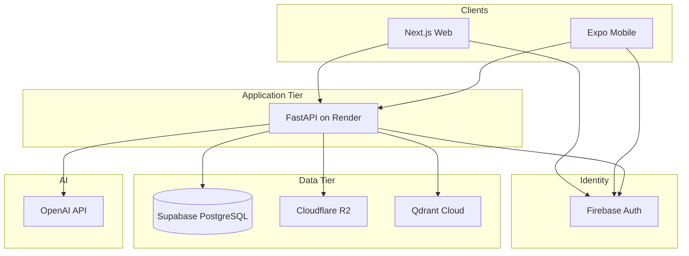

# System Architecture

**SANSON Legal OS · CoreLogic**

## High-level diagram



## Monorepo layout

```
apps/web          Next.js 15 static export
apps/backend      FastAPI + SQLAlchemy async
apps/mobile       Expo Router
packages/ui       Design system
packages/types    Shared TypeScript types
packages/shared   Constants
scripts/migrations SQL migrations 001–016
```

## Request flow (authenticated)

1. Client obtains Firebase ID token
2. `POST /api/v1/auth/sync` → PostgreSQL user + session device
3. Bearer token on all API calls
4. RBAC `require_permission` on protected routes
5. Audit + metrics middleware on every request

## Phase map

| Phase | Focus |
|-------|--------|
| 1 | Auth, RBAC, users, audit foundation |
| 2 | Legal requests, cases, workflow |
| 3 | AI intake chat |
| 4 | Documents, R2, OCR, evidence |
| 5 | Semantic search, knowledge base |
| 6 | Mobile, push, realtime sync |
| 7 | Security, audit intelligence, sessions |
| 8 | CI/CD, ops, monitoring, go-live |

## Multi-branch readiness (not multi-tenant)

Architecture supports future:

- `office_id` / `branch_id` on cases and users (schema extension)
- Per-branch feature flags via `system_settings`
- Regional CORS and storage prefixes on R2

**Multi-tenant isolation is deferred** — single firm database today.

## Scalability notes

- Render: scale instance size; stateless API
- Supabase: pooler for serverless connections
- R2: horizontal object storage
- Qdrant: dedicated cluster for search volume
- OpenAI: rate limits + circuit breaker + AI audit cost tracking
